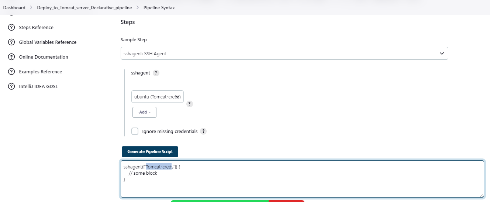

## Jenkins-tomcat declarative


```
pipeline {
    agent any
    
    tools {
        maven 'mvn 3'
    }
    

    stages {
        stage('Git checkout') {
            steps {
                git 'https://github.com/jaswanthnasa/tomcat-jenkins.git'
            }
        }
        stage('mvn build') {
            steps {
                sh "mvn clean install"
            }
        }
        stage('tomcat deploy') {
            steps {
                sshagent(['Tomcat-creds']) {
                sh "scp -o StrictHostKeyChecking=no target/*.war ubuntu@3.84.23.7:/opt/tomcat9/webapps"
                }
            }
        }
    }
}

```

### help section
```
mvn 3 ====> name of the maven added under managejenkins-->tools
sshagent=====> we have to install " SSH Agent Plugin" & also need to configure tomcat server creds [username,key] is syntax-gnerator


chown -R ubuntu:ubuntu /opt  ============> changing ownership permissions on opt dorectpry

```



refer youtube video below  <br/> 
[jenkins-tomcat-pipeline](https://www.youtube.com/watch?v=G_UCeeb5EPc&t=519s)


